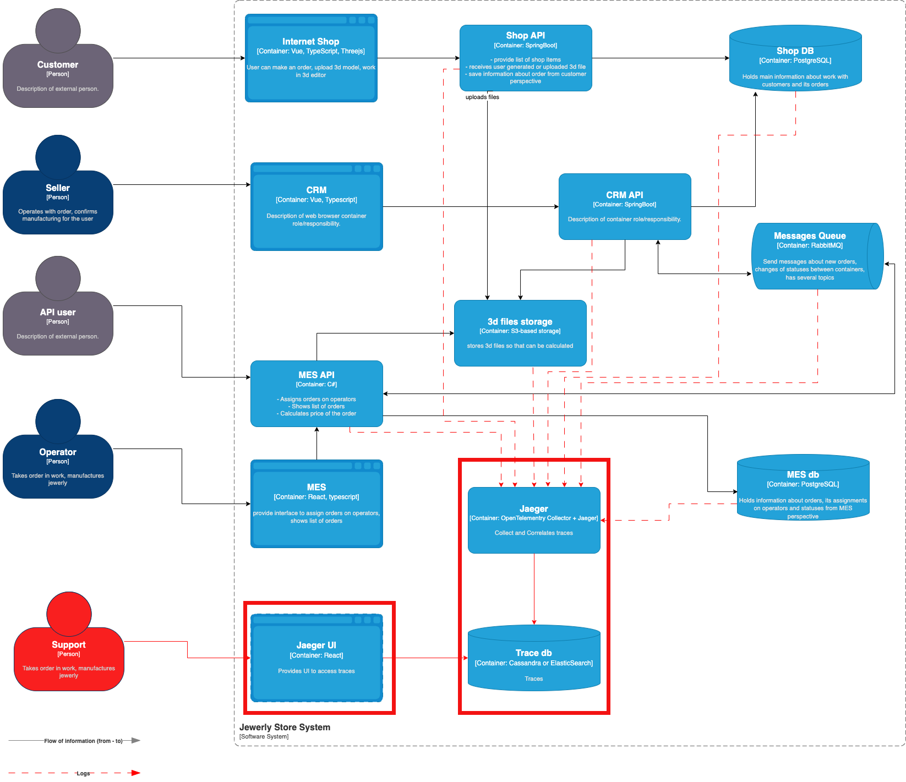

# Задание 3. Трейсинг

## Потенциальные точки отказа (Примеры)

Shop API:
 - не корректно сохранилась 3д модель или информация о заказе, 
 - заказ не перешел в статус SUBMITTED
CRM-API:
  - заказ не перешел в состояние MANUFACTURING_APPROVED (так как по какой-то причине CRM не увидел заказ)
  - запрос в сторону MES на подсчет стоимости или ответ не дошел до адресата изза переполнения очереди
MES
 - не посчитал стоимость заказа (так как не сохранилась 3д модель)
 - не отобразил новый заказ производству - заказ не перешел в состояние MANUFACTURING_STARTED

## Мотивация
Уже сейчас клиенты жалуются на задержки в выполнении заказов. Поскольку отсутствует трассировка,
то плавающие проблемы могут не воспроизводится и закрываться без решений. Это приводит к оттоку клиентов, 
потере заказов (в том числе уже сделанных). Кроме того повышается время исследования проблем.

Введение трассировки позволит:
- Ускорить решение проблем поддержкой (Уменьшит Mean Time to Repair, Cost per Ticket), а значит уменьшит нагрузку
 на поддержку (уменьшит Customer Support Cost), что даст экономию на персонале. 
- Уменьшить количество просроченных заявок (так как плавающие проблемы можно будет найти по трейсам)  
- Уменьшить процент клиентов, прекративших пользоваться продуктом (Churn Rate), так как в итоге повысится качество продукта
- Улучшить качество продукта, так как упростит тестирование неуспешных сценариев
- Определить узкие места системы при расширении, что снизит стоимость расширения масштабирования системы
- Повысит обучаемость новой системы для разработчиков и команды поддержки, так как трассировка может помочь
  понять как работает система (в какой последовательности вызываются функции).

## Предлагаемое решение
Предлагается использовать комбинацию технологий для генерации трейсов (OpenTelemetry) в API микросервисах 
  и инструмент (Jaeger) для анализа и выявления узких мест сервисов.

### Компромиссы

Cлучаи в которых трейсинг не принесёт пользы или пока невозможен, 
или его реализация обойдётся слишком дорого:

- Сложности трассировки проприетарных систем (Базы данных, RabbitMQ). 
  Нужна будет дорогостоящая доработка, чтобы выдать метрики в нужном формате. 

- Отсутствие заголовков (связано с предыдущим). Для проприетарных протоколов, например RabbitMQ,
  прийдется написать обёртку над сообщениями, чтобы скоррелировать сообщения с трейсами по Trace-ID в теле сообщения

- Поддержка инфраструктуры телеметрии может встать дорого (железо и потенциальный саппорт)

- Большой масштаб системы. В случаях высоконагруженных систем хранение
  всех трейсов будет стоить очень дорого и нужно будет придумывать механизмы хранения только
 важных (например нет смысла хранить трейсы для успешно завершенных заказов)
 
### Аспекты безопасности

- Трейсы не должны включать никаких персональных данных
- Доступ к хранилищу трейсов и подсистеме трассировки должны иметь только авторизованные лица
  с ролью поддержка. 
- Поддержка авторизации через отдельный сервер (например с поддержкой OAuth)
- Для доступак трейсам могут быть использованы только защищенные каналы связи
  (VPN для доступа извне компании)
