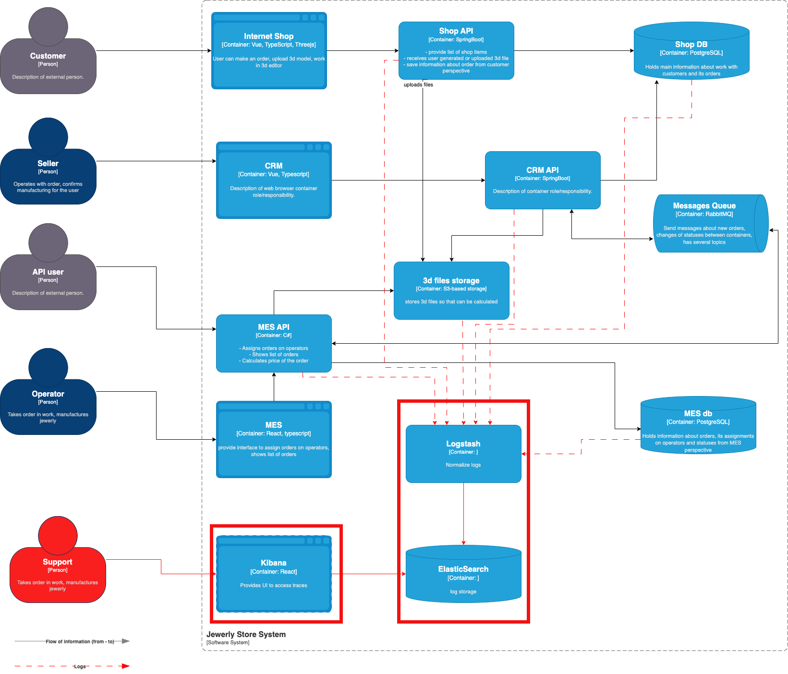

# Задание 4. Логирование

## Список логов для системы

Ниже можно найти набор потенциальных логов с их 

|Компонент|Описание лога|Уровень логирования|Что включает|
---
|Shop Api| Application started | INFO | DateTime |
|Shop Api| Order status update | INFO | OrderID, DateTime, NewStatus, UserID, Status Optional Info |
|Shop Api| User logged into the system | INFO | UserID, DateTime |
|CRM| Application started | INFO | DateTime |
|CRM| Order status update | INFO | OrderID, DateTime, NewStatus, SellerID, Status Optional Info |
|Shop API| Application started | INFO | DateTime |
|Shop Api| User logged into the system | INFO | UserID, DateTime |
|MES| Application started | INFO | DateTime |
|MES| Order status update | INFO | OrderID, DateTime, NewStatus, Status Optional Info |
|MES| Order is assigned to operator | INFO | OrderID, DateTime, OperatorID |

**NOTE1:** Order created и Order closed считаются как изменения соответсвующих статуов и будут рапортоваться как 
логи изменения статуса.
**NOTE2:** Status Optional Info - дополнительная информация по статусу, например:
- FileName, FileSize для FILE_UPLOADED
- Price для PRICE_CALCULATED
- User type и UserID или API User ID для PRICE_CALCULATED
- OperatorID для MANUFACTURING_STARTED, MANUFACTURING_COMPLETED, PACKAGING, SHIPPED

Логи с уровнями ERROR и WARN будут для случая постоянных (непоправимых) ошибок (в том числе необработанных исключений)
 или временных ошибок, которые можно исправить (например  информация о ретраях) соответственно.

Логи с уровнями DEBUG и TRACE будут создаваться для случаев, когда что-то происходит в системе и позволят
 разработчикам понять, что именно и как происходило - например на CRM был вставлен запрос к/получен ответ от MES
 через rabbitmq или промежуточные шаги подсчета стоимости изготовления заказа.

## Мотивация
Система логирования позволит повысить прозрачность системы для служб поддержки, что увеличит возможности команды
поддержки и разработчиков по нахождению проблем, в том числе проактивно (до обращения пользователя). 

В свою очередь это позволит:
- Ускорить решение проблем поддержкой (Уменьшит Mean Time to Repair, Cost per Ticket), а значит уменьшит нагрузку
 на поддержку (уменьшит Customer Support Cost), что даст экономию на персонале. 
- Уменьшить количество просроченных заявок (так как плавающие проблемы можно будет найти по логам)  
- Уменьшить процент клиентов, прекративших пользоваться продуктом (Churn Rate), так как в итоге повысится качество продукта
- Улучшить качество продукта, так как упростит тестирование неуспешных сценариев

Поскольку настроить одновременно логгирование и мониторинг для всей системы очень затратно, то предлагается добавлять 
логгирование постепенно в следующей последовательности:
1) MES-API (точка входа не только B2C, но и B2B клиентов. Микросервис, где операторы забирают заказы)
2) CRM-API (точка управления и подтверждения заказов)
3) Shop-API (Микросервис для создания B2C заказа)

## Предлагаемое решение

В качестве решения можно предложить систему из нескольких элементов, которые вытягивают логи из приложений
(например FileBeat), коллекционируют и нормализют логи (Logstash), сохраняют и индексируют логи (elasticsearch)
 и отображают логи (Kibana)

Предполагаемый срок хранения логов должен превышать как минмум вдвое от ожидаемого времени исполнения заказа
 для того чтобы при анализе проблем с задержками выполнения заказа логи от начала заказа не успевали удалится. 
Также потенциально можно хранить логи 2-3 года в долговременном хранилище (если есть необходиомсть).

### Аспекты безопасности

- Логи не должны включать никаких персональных и чувствительных данных. Если это необходимо, то при экспорте
 логов все чувствительные данные должны быть замаскированы
  данные должны быть 
- Доступ к хранилищу логов и подсистеме логгирования должны иметь только авторизованные лица
  с ролью поддержка. 
- Поддержка авторизации через отдельный сервер (например с поддержкой OAuth)
- Для доступа к логам снаружи чмогут быть использованы только защищенные каналы связи
  (VPN для доступа извне компании)

### мероприятия для превращения системы сбора логов в систему анализа логов

На базе анализа логов можно построить систему, которая обнаруживала и сигнализировала бы о следующих аномалиях (как пример):
- слишком большое количество созданных заказов в заданный промежуток от конкретных пользователей или компаний (спамеры) 
 - можно просигнализировать в поддержку
 - можно поставить таких пользователей на карантин, запретив временно создавать заказы
- зависание большого количества заказов в определенном состянии (например количество созданных заказов вдруг стало в 5 раз больше, чем заапрувленных )
 - можно просигнализировать в поддержку

### критерии для выбора технологии для работы с логами

| Критерий | ELK Stack | Splunk | Graylog |
---
| Основная функция | Сбор, агрегация и анализ логов | Сбор, анализ и визуалиация больших данных |Централизованный сбор и анализ логов |
| Масштабируемость | Высокая | Высокая | Средняя |
| Удобство использования | Средняя (требуется настройка) | Высокая (простой интерфейс) | Высокая (простота настройки) |
| Поиск и анализ данных | Мощные возможности поиска в Elasticsearch | Сложные поисковые запросы и алерты | Эффективный поиск и алерты |
| Визуализация | Гибкие дашборды в Kibana | Гибкая визуализация и отчетность | Стандартные дашборды и графики |
| Расширяемость | Высокая (множество плагинов и интеграций) | Модульная система плагинов | Поддержка плагинов и интеграций |
| Безопасность | Настройки доступа и шифрования | Расширенные функции управления и безопасности | Настройки доступа и фильтрации |
| Лицензирование | Open Source (с платными дополнениями) | Проприетарный (с бесплатным ограниченным использованием) | Open Source (с коммерческими опциями) |