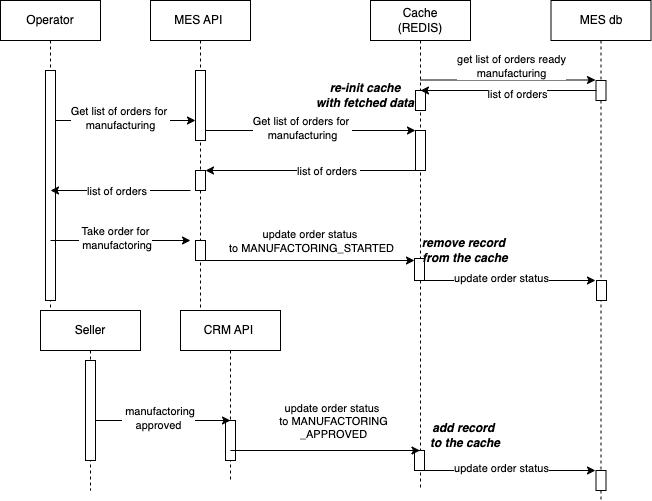

# Задание 5. Кеширование

## Мотивация

Кеширование необходимо для сохранения ресурсов системы при частых повторяющихся
запросах клиентов. В случае системы компании «Александрит» можно предположить, что 
часто повторяющихся операции 2 типа:
- подгрузка изображения изделия из заказа (ее можно кешировать на стороне браузера/клиента)
- подгрузка заказов готовых к производству (в случае, когда оператор готов взять заказ)
  оператором - оператор видит несколько заказов и берет один из них. В случае большой загрузки
  операторы могут запрашивать одни и те же данные по несколько раз. Поэтому есть смысл
 закешировать данные запросы. Предполагается, что меняются такие данные не очень часто,
 а оператор и пользователи MES клиента могут заглядывать часто.
Это снизит нагрузку на базу данных и клиенты, жалующиеся на задержки в отображении заказов будут
 получать данные быстрее, что уменьшит отток клиентов и увеличит их удовлетворенность работой
 приложения непосредственно или через QCM API.

## Предлагаемое решение
Поскольку, кеш должен хранить информацию о частых запросах и инвалидироваться
 в случае изменений (например новый заказ назначен на исполнение или взят в работу), причем нужно ускорить время ответа, то режимы  read-through и write-through для MES-API микросервиса подходят для этой цели лучше всего. В этом случае
1. время отклика сократиться, так как кеш уже имеет пред-загруженные данные, а значит и ответ будет бустрее
2. актуальность данных будет гораздо выше, чем в других подходах, так как предполагается, что в случае изменения данных о состоянии продукта будет обновляться напрямую из приложения, которое инициировало переход. 

